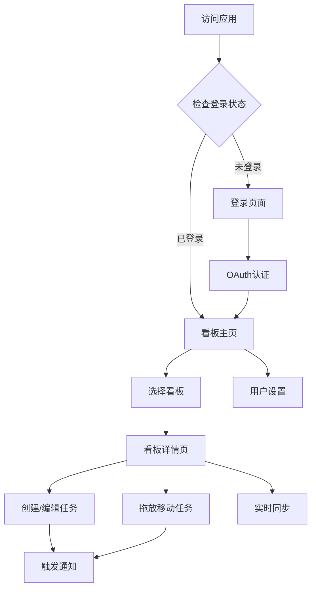

# Todo List 看板应用产品需求文档

## 1. Product Overview

基于Next.js 15和Supabase构建的现代化Todo List看板应用，提供完整的任务管理和团队协作功能。
- 解决个人和团队任务管理效率问题，支持多状态任务流转和实时协作，为用户提供类似Notion、Trello的专业看板体验。
- 目标打造企业级任务管理解决方案，支持多租户架构和高并发实时同步。

## 2. Core Features

### 2.1 User Roles

| Role | Registration Method | Core Permissions |
|------|---------------------|------------------|
| 注册用户 | Google OAuth / GitHub OAuth | 创建和管理个人看板、列表和卡片，查看个人数据 |
| 匿名用户 | 无需注册 | 仅可访问登录页面和产品介绍 |

### 2.2 Feature Module

我们的Todo看板应用包含以下核心页面：
1. **登录页面**：OAuth认证选择、用户状态管理
2. **看板主页**：看板列表展示、创建新看板、快速访问
3. **看板详情页**：任务列表管理、卡片拖放操作、实时同步显示
4. **用户设置页**：个人信息管理、通知偏好设置

### 2.3 Page Details

| Page Name | Module Name | Feature description |
|-----------|-------------|---------------------|
| 登录页面 | OAuth认证模块 | 集成Google和GitHub OAuth登录，显示登录状态，处理认证回调和错误 |
| 登录页面 | 用户会话管理 | 检测用户登录状态，自动跳转到看板页面，管理会话持久化 |
| 看板主页 | 看板列表展示 | 显示用户所有看板，支持网格和列表视图切换，显示看板统计信息 |
| 看板主页 | 看板创建管理 | 创建新看板，设置看板名称和描述，选择看板模板 |
| 看板详情页 | 任务列表管理 | 显示待办、进行中、完成、失败四个状态列表，支持列表重命名和排序 |
| 看板详情页 | 卡片拖放操作 | 实现卡片在不同状态列表间拖放移动，支持批量操作和快捷键 |
| 看板详情页 | 卡片CRUD操作 | 创建、编辑、删除任务卡片，设置优先级、截止日期、标签和描述 |
| 看板详情页 | 实时同步显示 | 基于WebSocket实现多用户实时数据同步，显示其他用户操作状态 |
| 看板详情页 | 通知系统 | 任务状态变更时触发通知，支持浏览器推送和应用内通知 |
| 用户设置页 | 个人信息管理 | 显示和编辑用户基本信息，头像上传，账户安全设置 |
| 用户设置页 | 通知偏好设置 | 配置通知类型和频率，设置邮件和推送通知偏好 |

## 3. Core Process

**用户认证流程：**
用户访问应用 → 检测登录状态 → 未登录则跳转登录页 → 选择OAuth提供商 → 完成认证 → 跳转看板主页

**任务管理流程：**
进入看板详情页 → 创建新任务卡片 → 设置任务详情 → 拖放移动任务状态 → 实时同步到其他设备 → 状态变更触发通知

**多用户协作流程：**
用户A修改任务 → 数据库更新 → WebSocket推送变更 → 用户B实时接收更新 → UI自动刷新显示最新状态

## 4. User Interface Design

### 4.1 Design Style

- **主色调**：#3B82F6 (蓝色)，辅助色：#10B981 (绿色)、#F59E0B (橙色)、#EF4444 (红色)
- **按钮样式**：圆角设计，支持悬停和点击动画效果，主要按钮采用渐变背景
- **字体**：Inter字体，标题16-24px，正文14-16px，小字12px
- **布局风格**：卡片式设计，顶部导航栏，侧边栏可收缩，网格布局适配响应式
- **图标风格**：使用Heroicons图标库，线性风格，支持深色模式切换

### 4.2 Page Design Overview

| Page Name | Module Name | UI Elements |
|-----------|-------------|-------------|
| 登录页面 | OAuth认证模块 | 居中卡片布局，品牌Logo，Google/GitHub登录按钮，渐变背景，加载动画 |
| 看板主页 | 看板列表展示 | 顶部导航栏，搜索框，网格卡片布局，每个看板卡片显示标题、描述、进度条 |
| 看板详情页 | 任务列表管理 | 四列布局(待办/进行中/完成/失败)，每列标题可编辑，拖放区域高亮 |
| 看板详情页 | 卡片拖放操作 | 任务卡片阴影效果，拖拽时半透明，放置区域边框高亮，平滑动画过渡 |
| 用户设置页 | 个人信息管理 | 左侧设置菜单，右侧内容区域，表单输入框，头像上传组件 |

### 4.3 Responsiveness

桌面优先设计，完全适配移动端。移动端采用单列布局，支持触摸拖放操作，优化手势交互体验。平板设备采用两列布局，保持良好的视觉层次和操作便利性。