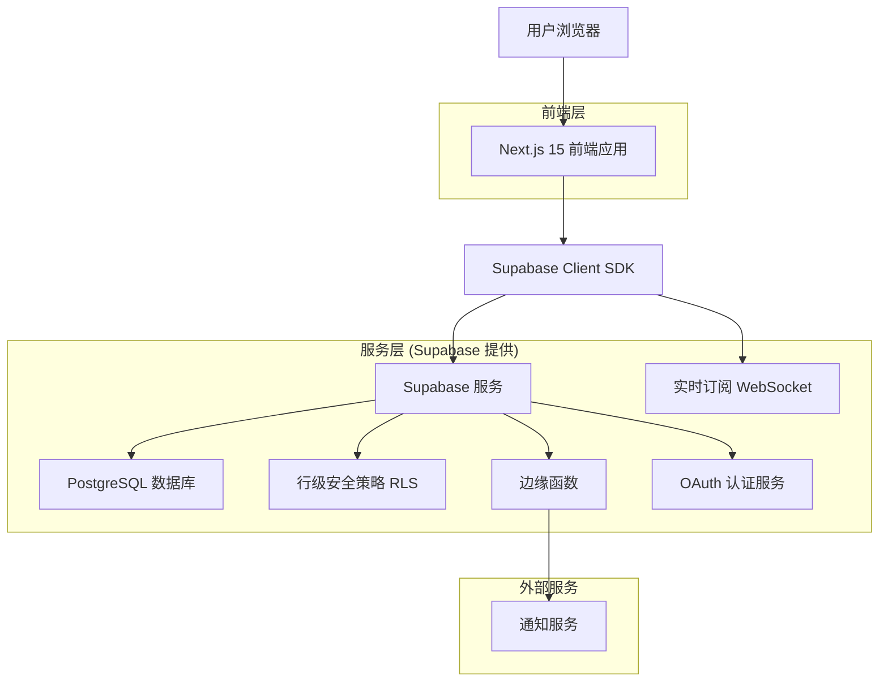
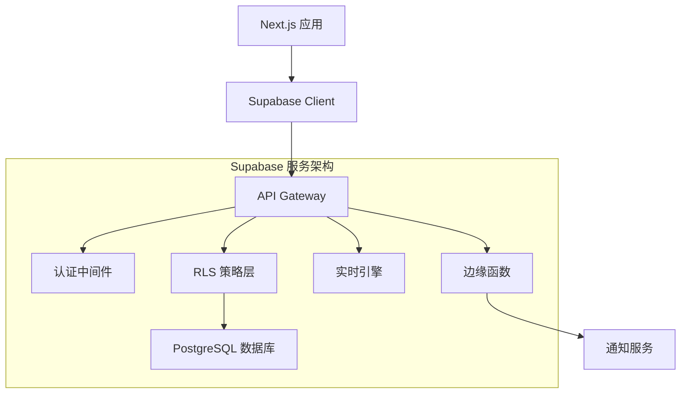
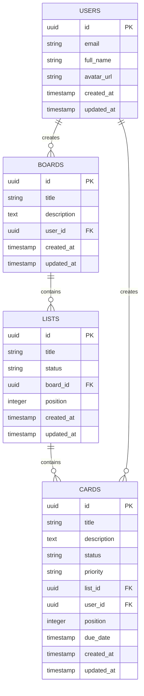

# Todo List 看板应用技术架构文档

## 1. Architecture design



## 2. Technology Description

* Frontend: Next.js\@15 + React\@18 + TypeScript\@5 + Tailwind CSS\@3 + @dnd-kit/core\@6 + @supabase/supabase-js\@2

* Backend: Supabase (PostgreSQL + 实时订阅 + 边缘函数 + OAuth认证)

* 状态管理: React Context + useState/useEffect

* UI组件: Headless UI + Heroicons

* 构建工具: Turbopack (Next.js 15内置)

## 3. Route definitions

| Route              | Purpose                      |
| ------------------ | ---------------------------- |
| /                  | 首页，检测登录状态并重定向到看板或登录页         |
| /login             | 登录页面，提供Google和GitHub OAuth认证 |
| /dashboard         | 看板主页，显示用户所有看板列表              |
| /board/\[id]       | 看板详情页，显示具体看板的任务列表和卡片         |
| /settings          | 用户设置页面，管理个人信息和通知偏好           |
| /api/auth/callback | OAuth认证回调处理                  |

## 4. API definitions

### 4.1 Core API

**用户认证相关**

```typescript
// Supabase Auth API (自动生成)
POST /auth/v1/token
GET /auth/v1/user
POST /auth/v1/logout
```

**看板管理**

```typescript
GET /rest/v1/boards
```

Request Headers:

| Header Name   | Type   | Required | Description       |
| ------------- | ------ | -------- | ----------------- |
| Authorization | string | true     | Bearer token      |
| apikey        | string | true     | Supabase anon key |

Response:

| Field Name  | Type      | Description |
| ----------- | --------- | ----------- |
| id          | uuid      | 看板唯一标识      |
| title       | string    | 看板标题        |
| description | string    | 看板描述        |
| user\_id    | uuid      | 创建用户ID      |
| created\_at | timestamp | 创建时间        |
| updated\_at | timestamp | 更新时间        |

**任务卡片管理**

```typescript
POST /rest/v1/cards
PATCH /rest/v1/cards?id=eq.{card_id}
DELETE /rest/v1/cards?id=eq.{card_id}
```

Request (创建卡片):

| Param Name  | Param Type | Required | Description                            |
| ----------- | ---------- | -------- | -------------------------------------- |
| title       | string     | true     | 卡片标题                                   |
| description | string     | false    | 卡片描述                                   |
| status      | string     | true     | 状态: todo/in\_progress/completed/failed |
| list\_id    | uuid       | true     | 所属列表ID                                 |
| priority    | string     | false    | 优先级: low/medium/high                   |
| due\_date   | timestamp  | false    | 截止日期                                   |

**实时订阅**

```typescript
// WebSocket 连接
supabase
  .channel('boards')
  .on('postgres_changes', {
    event: '*',
    schema: 'public',
    table: 'cards'
  }, payload => {
    // 处理实时数据变更
  })
  .subscribe()
```

## 5. Server architecture diagram



## 6. Data model

### 6.1 Data model definition



### 6.2 Data Definition Language

**用户表 (users) - 由Supabase Auth自动管理**

```sql
-- Supabase 自动创建 auth.users 表
-- 创建公共用户配置表
CREATE TABLE public.user_profiles (
    id UUID REFERENCES auth.users(id) PRIMARY KEY,
    email VARCHAR(255) NOT NULL,
    full_name VARCHAR(100),
    avatar_url TEXT,
    created_at TIMESTAMP WITH TIME ZONE DEFAULT NOW(),
    updated_at TIMESTAMP WITH TIME ZONE DEFAULT NOW()
);

-- 启用 RLS
ALTER TABLE public.user_profiles ENABLE ROW LEVEL SECURITY;

-- RLS 策略：用户只能访问自己的配置
CREATE POLICY "Users can view own profile" ON public.user_profiles
    FOR SELECT USING (auth.uid() = id);

CREATE POLICY "Users can update own profile" ON public.user_profiles
    FOR UPDATE USING (auth.uid() = id);
```

**看板表 (boards)**

```sql
CREATE TABLE public.boards (
    id UUID PRIMARY KEY DEFAULT gen_random_uuid(),
    title VARCHAR(255) NOT NULL,
    description TEXT,
    user_id UUID REFERENCES auth.users(id) ON DELETE CASCADE NOT NULL,
    created_at TIMESTAMP WITH TIME ZONE DEFAULT NOW(),
    updated_at TIMESTAMP WITH TIME ZONE DEFAULT NOW()
);

-- 启用 RLS
ALTER TABLE public.boards ENABLE ROW LEVEL SECURITY;

-- RLS 策略
CREATE POLICY "Users can view own boards" ON public.boards
    FOR SELECT USING (auth.uid() = user_id);

CREATE POLICY "Users can create own boards" ON public.boards
    FOR INSERT WITH CHECK (auth.uid() = user_id);

CREATE POLICY "Users can update own boards" ON public.boards
    FOR UPDATE USING (auth.uid() = user_id);

CREATE POLICY "Users can delete own boards" ON public.boards
    FOR DELETE USING (auth.uid() = user_id);

-- 创建索引
CREATE INDEX idx_boards_user_id ON public.boards(user_id);
CREATE INDEX idx_boards_created_at ON public.boards(created_at DESC);
```

**列表表 (lists)**

```sql
CREATE TABLE public.lists (
    id UUID PRIMARY KEY DEFAULT gen_random_uuid(),
    title VARCHAR(255) NOT NULL,
    status VARCHAR(50) NOT NULL CHECK (status IN ('todo', 'in_progress', 'completed', 'failed')),
    board_id UUID REFERENCES public.boards(id) ON DELETE CASCADE NOT NULL,
    position INTEGER NOT NULL DEFAULT 0,
    created_at TIMESTAMP WITH TIME ZONE DEFAULT NOW(),
    updated_at TIMESTAMP WITH TIME ZONE DEFAULT NOW()
);

-- 启用 RLS
ALTER TABLE public.lists ENABLE ROW LEVEL SECURITY;

-- RLS 策略：通过 board 关联检查权限
CREATE POLICY "Users can view lists of own boards" ON public.lists
    FOR SELECT USING (
        EXISTS (
            SELECT 1 FROM public.boards 
            WHERE boards.id = lists.board_id 
            AND boards.user_id = auth.uid()
        )
    );

CREATE POLICY "Users can manage lists of own boards" ON public.lists
    FOR ALL USING (
        EXISTS (
            SELECT 1 FROM public.boards 
            WHERE boards.id = lists.board_id 
            AND boards.user_id = auth.uid()
        )
    );

-- 创建索引
CREATE INDEX idx_lists_board_id ON public.lists(board_id);
CREATE INDEX idx_lists_position ON public.lists(position);
```

**卡片表 (cards)**

```sql
CREATE TABLE public.cards (
    id UUID PRIMARY KEY DEFAULT gen_random_uuid(),
    title VARCHAR(255) NOT NULL,
    description TEXT,
    status VARCHAR(50) NOT NULL CHECK (status IN ('todo', 'in_progress', 'completed', 'failed')),
    priority VARCHAR(20) DEFAULT 'medium' CHECK (priority IN ('low', 'medium', 'high')),
    list_id UUID REFERENCES public.lists(id) ON DELETE CASCADE NOT NULL,
    user_id UUID REFERENCES auth.users(id) ON DELETE CASCADE NOT NULL,
    position INTEGER NOT NULL DEFAULT 0,
    due_date TIMESTAMP WITH TIME ZONE,
    created_at TIMESTAMP WITH TIME ZONE DEFAULT NOW(),
    updated_at TIMESTAMP WITH TIME ZONE DEFAULT NOW()
);

-- 启用 RLS
ALTER TABLE public.cards ENABLE ROW LEVEL SECURITY;

-- RLS 策略
CREATE POLICY "Users can view cards of own boards" ON public.cards
    FOR SELECT USING (
        EXISTS (
            SELECT 1 FROM public.lists 
            JOIN public.boards ON boards.id = lists.board_id
            WHERE lists.id = cards.list_id 
            AND boards.user_id = auth.uid()
        )
    );

CREATE POLICY "Users can manage own cards" ON public.cards
    FOR ALL USING (auth.uid() = user_id);

-- 创建索引
CREATE INDEX idx_cards_list_id ON public.cards(list_id);
CREATE INDEX idx_cards_user_id ON public.cards(user_id);
CREATE INDEX idx_cards_status ON public.cards(status);
CREATE INDEX idx_cards_position ON public.cards(position);
CREATE INDEX idx_cards_due_date ON public.cards(due_date);
```

**自动更新时间戳函数**

```sql
-- 创建更新时间戳函数
CREATE OR REPLACE FUNCTION update_updated_at_column()
RETURNS TRIGGER AS $$
BEGIN
    NEW.updated_at = NOW();
    RETURN NEW;
END;
$$ language 'plpgsql';

-- 为所有表创建触发器
CREATE TRIGGER update_user_profiles_updated_at BEFORE UPDATE ON public.user_profiles
    FOR EACH ROW EXECUTE FUNCTION update_updated_at_column();

CREATE TRIGGER update_boards_updated_at BEFORE UPDATE ON public.boards
    FOR EACH ROW EXECUTE FUNCTION update_updated_at_column();

CREATE TRIGGER update_lists_updated_at BEFORE UPDATE ON public.lists
    FOR EACH ROW EXECUTE FUNCTION update_updated_at_column();

CREATE TRIGGER update_cards_updated_at BEFORE UPDATE ON public.cards
    FOR EACH ROW EXECUTE FUNCTION update_updated_at_column();
```

**初始化数据**

```sql
-- 创建默认列表状态
INSERT INTO public.lists (title, status, board_id, position) VALUES
('待办事项', 'todo', '{board_id}', 0),
('进行中', 'in_progress', '{board_id}', 1),
('已完成', 'completed', '{board_id}', 2),
('已失败', 'failed', '{board_id}', 3);

-- 示例卡片数据
INSERT INTO public.cards (title, description, status, list_id, user_id, position) VALUES
('设计用户界面', '创建现代化的看板界面设计', 'todo', '{list_id}', '{user_id}', 0),
('实现拖放功能', '使用 @dnd-kit 实现卡片拖放',
```

